# WhatsApp 和 Telegram 多账号全球跨境社交聚合聊天翻译软件计数器

## 目录

- [客户端功能](#客户端功能)
  - [功能特点](#功能特点)
  - [下载体验](#下载体验)
    - [会话管理](#会话管理)
    - [会话代理设置](#会话代理设置)
    - [双向聊天实时翻译](#双向聊天实时翻译)
    - [用户画像](#用户画像)
    - [快捷回复](#快捷回复)
  - [平台接入设置](#平台接入设置)
- [后端功能](#后端功能)
  - [项目架构](#项目架构)
  - [文档](#文档)
  - [项目截图](#项目截图)
    - [后台管理](#后台管理)
  - [备注](#备注)
  - [免责声明](#免责声明)
- [联系方式](#联系方式)

---

## 功能特点

全球跨境SCRM出海社交聚合平台翻译软件计数器全套源码程序，支持win和mac系统安装，支持各大主流社交平台无限多开,全套源码可二开,多合一聚合便捷聊天，任意社交平台可无限多开窗口
1. 账号多开，独立环境独立 cookie 数据，可无限多开管理账号
2. 独立代理，每个会话可以单独配置代理信息
3. 聚合翻译，软件内置翻译功能，聊天实时翻译，可自定义翻译语言
4. 支持实时翻译社交平台如下：whatsapp、telegram、line、facebook、lnstagram、X应用（twitter）、zalo、tiktok平台
5. 目前进粉统计计数器支持：（whatsapp、telegram、line、zalo）平台
6. 支持消息实时双向翻译输入框实时翻译可设置禁发中文，智能快捷多模式回复，指纹浏览器可对单一线路设置代理

## 下载体验

- **邀请码**：XXXXXXXXX
- **下载地址（Windows）**：https://XXXXXXXXXXX  

### 界面预览

- **登录页面**  
  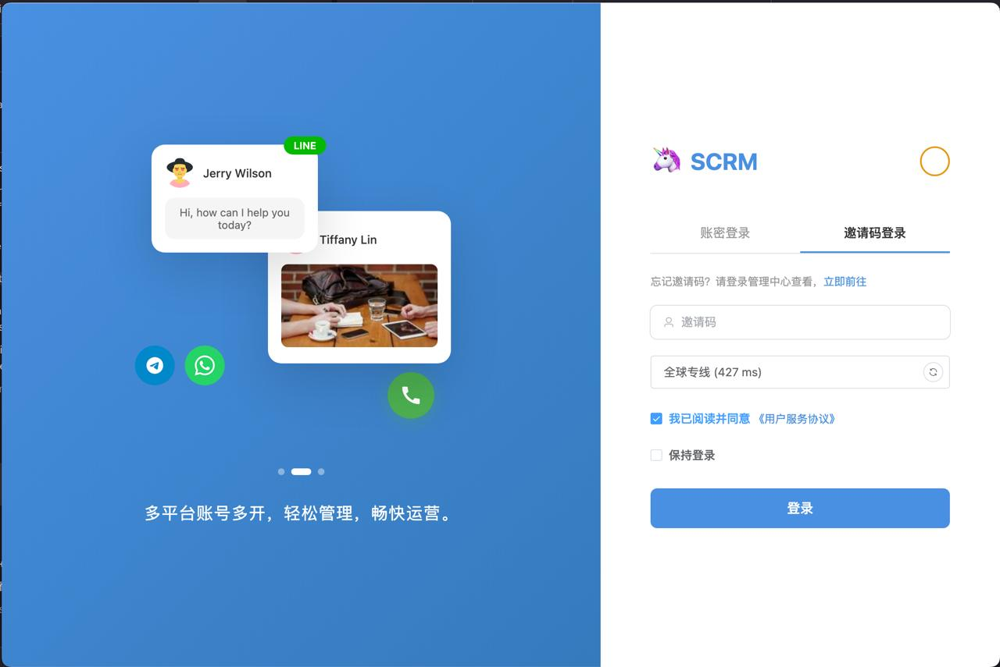

- **首页**  
  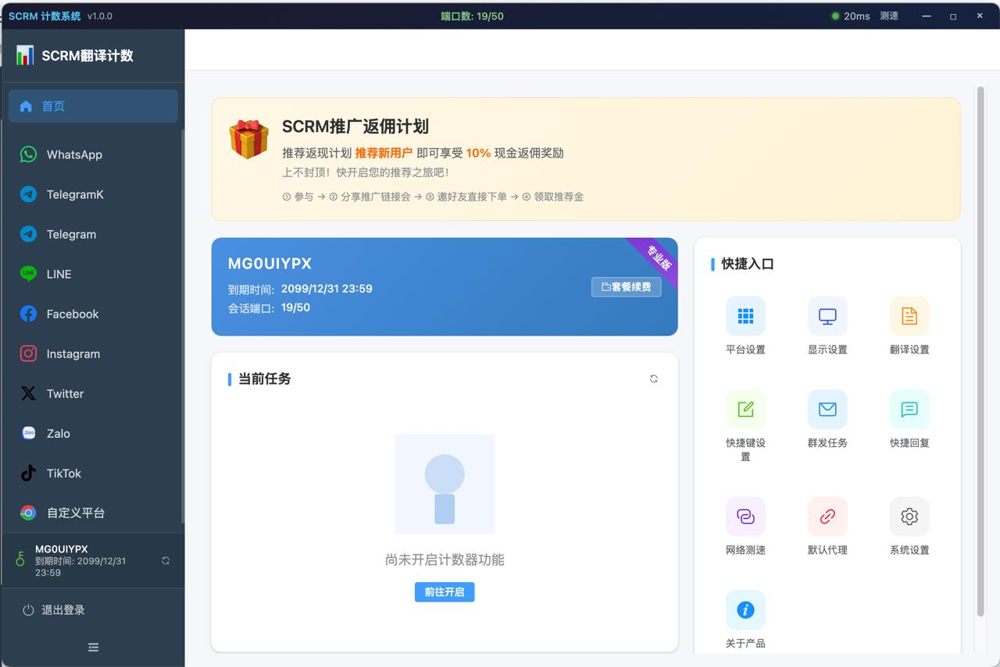

### 会话管理

- **WhatsApp 粉丝计数器**  
  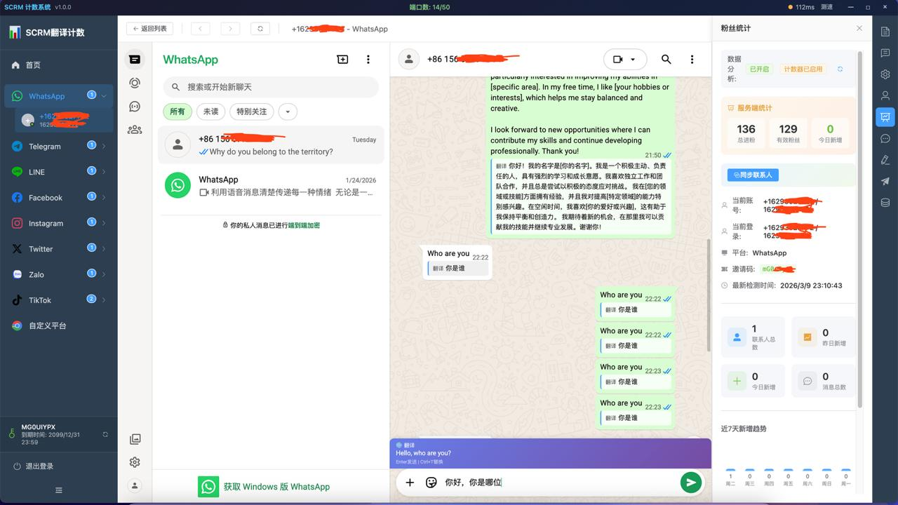

- **Telegram 会话管理**  
  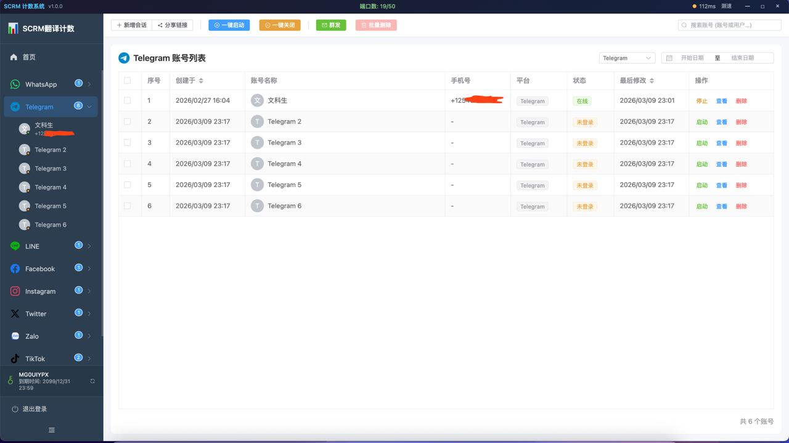  

### 会话代理设置
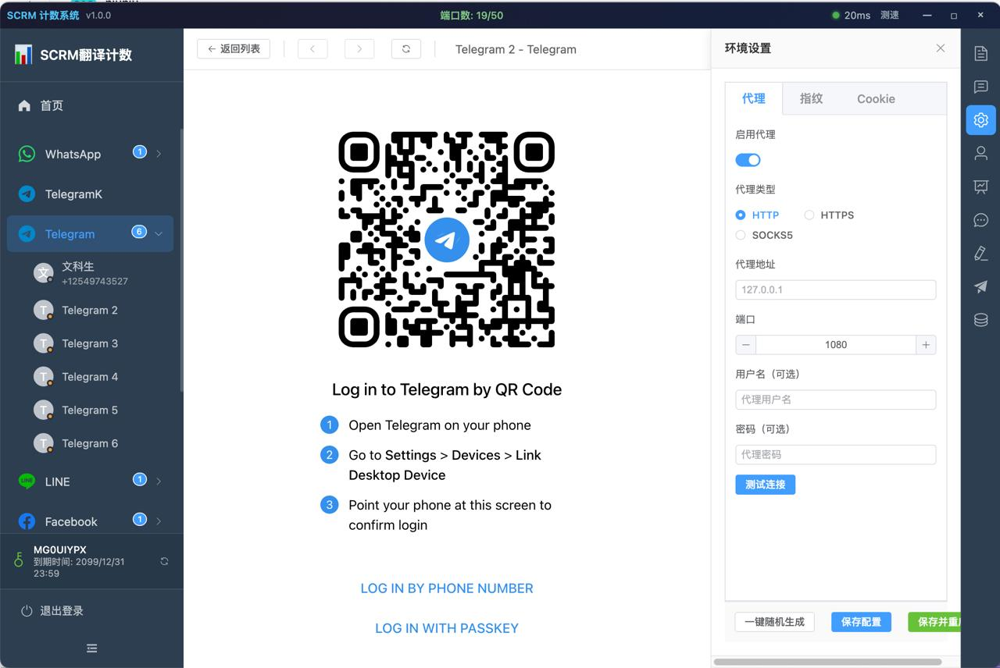

### 双向聊天实时翻译
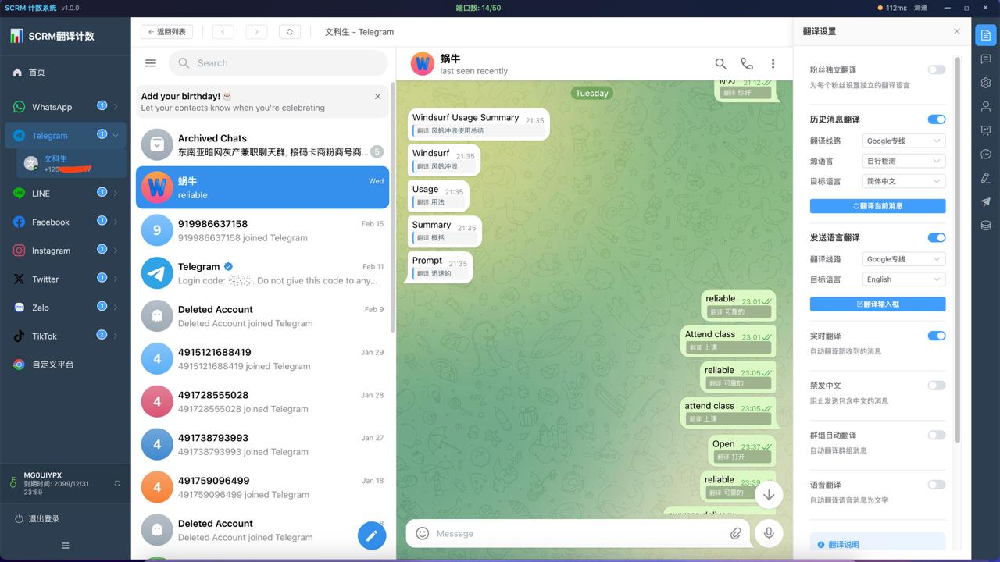

### 双向聊天实时翻译
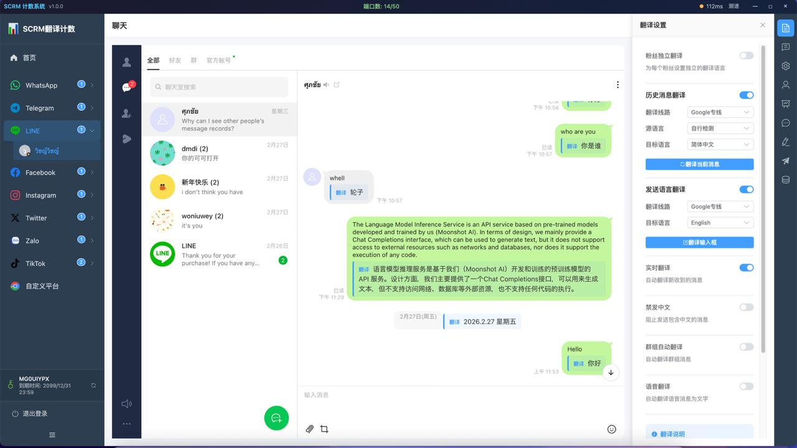

### 双向聊天实时翻译
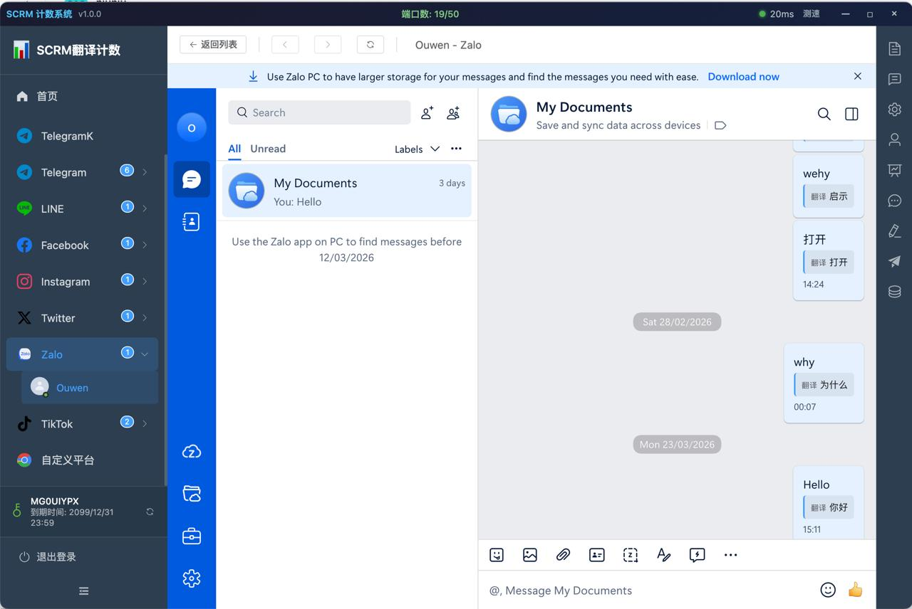

### 用户画像

### 快捷回复

#### 群发消息
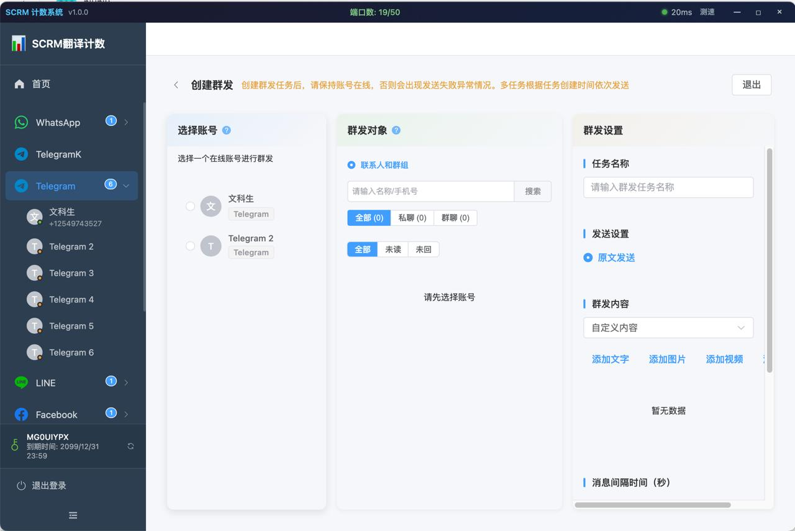

## 平台接入设置
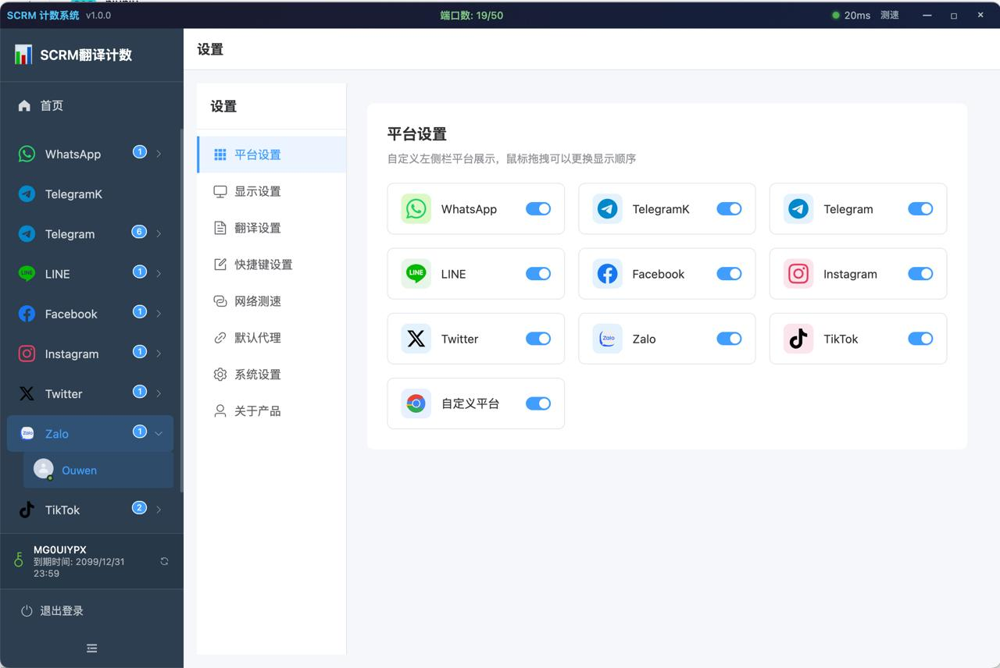

---

WhatsApp 多账号管理、Telegram 多账号管理、Line 多账号管理、Zalo 多账号管理等多平台 实时翻译计数器

## 项目架构

- **桌面端**：electron
- **翻译端**：Go、Mysql、JWT、Gorilla websocket、Redis、Vue 的前后端分离的后台管理系统

## 文档

- 桌面端使用 electron 

## 项目截图

### 后台管理

- **前台页面**（展示用户的前台页面）  
  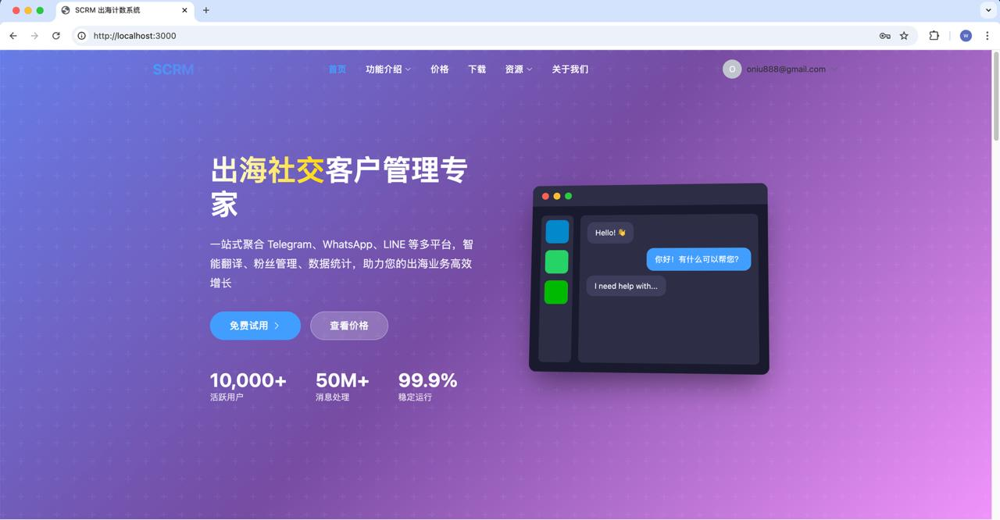

- **后台管理1**（主要用于查看控制台数据 API 调用量）  
  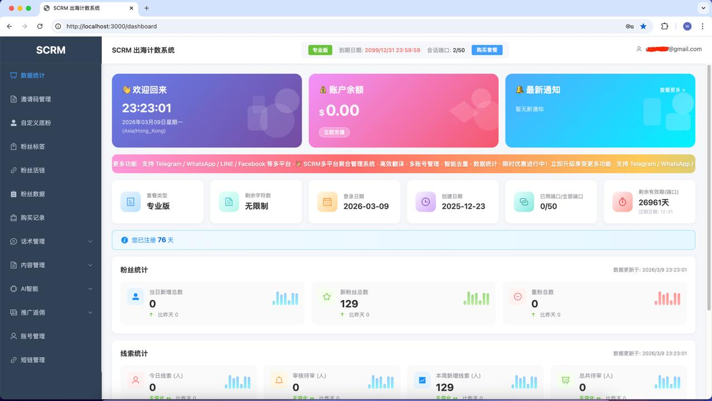

- **后端管理2**（可以编辑邀请码设置邀请码类型端口和字节，设置此邀请码可拥有的平台权限）  
  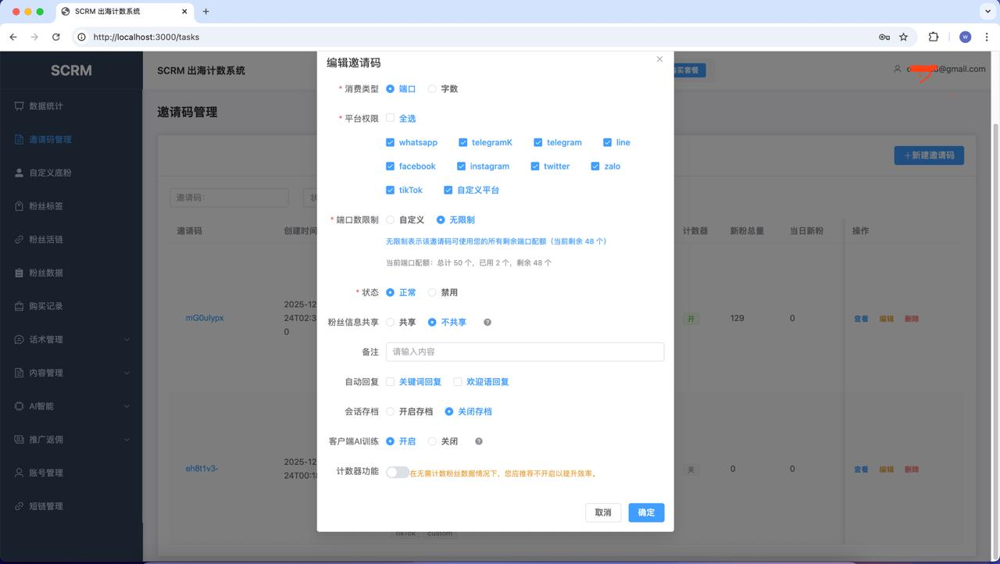

- **后端管理3**（可查看当前邀请码的进粉情况，统计当日进粉总数，账号当日进粉统计数据）  
  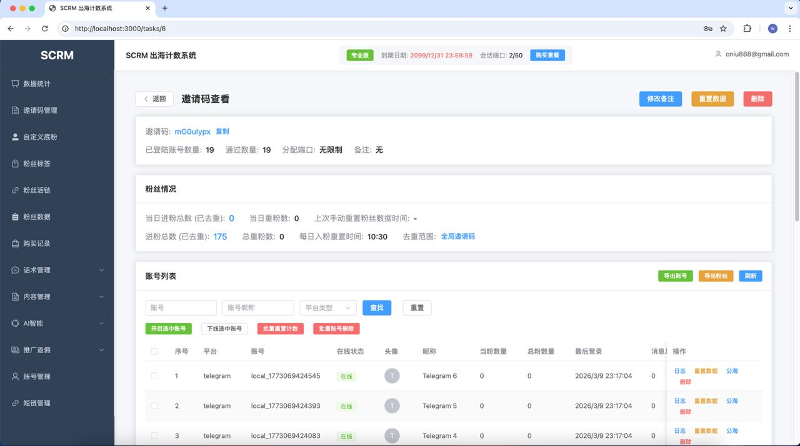

## 备注

- 项目目前实现了众多的功能，项目也可以二次开发
- 欢迎提交宝贵意见，如有 bug，请提交 issue，我看到有时间会进行修复

## 免责声明

- 在使用本项目之前，您应自行评估并承担相应的风险。项目贡献者不保证本项目适合您的特定需求或用途，也不保证项目的完整性、准确性和及时性。

- 使用本项目即表示您同意自行承担所有风险和责任。对于因使用或无法使用本项目而引起的任何索赔、损害或其他责任，项目贡献者概不负责。

## 联系方式

如有问题或需要帮助，欢迎通过以下方式联系：

- **Telegram**: [@oniu888](https://t.me/oniu888)
