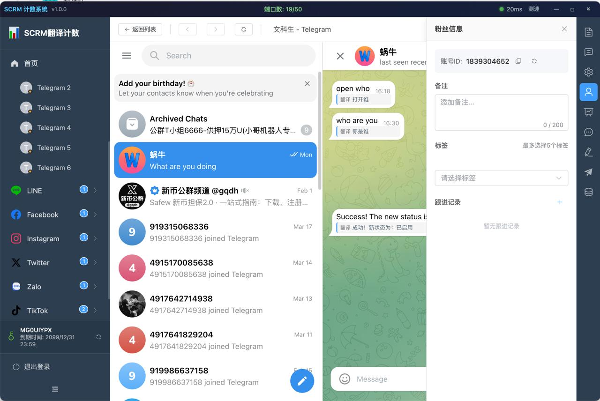

# WhatsApp 和 Telegram 多账号管理工具

## 目录

- [付费版本](#付费版本)
  - [功能特点](#功能特点)
  - [下载体验](#下载体验)
    - [会话管理](#会话管理)
    - [会话代理设置](#会话代理设置)
    - [双向聊天实时翻译](#双向聊天实时翻译)
    - [用户画像](#用户画像)
    - [快捷回复](#快捷回复)
  - [本地翻译接入](#本地翻译接入)
- [免费版本](#免费版本)
  - [项目架构](#项目架构)
  - [功能介绍](#功能介绍)
  - [文档](#文档)
  - [项目截图](#项目截图)
    - [桌面端](#桌面端)
    - [后台翻译端](#后台翻译端)
  - [项目启动流程](#项目启动流程)
  - [备注](#备注)
  - [免责声明](#免责声明)
- [联系方式](#联系方式)

---

# 付费版本

## 功能特点

- 架构优化，客户端代码重构，运行效率更高；开发更便捷
- 客户端多语言支持
- 单体版本，翻译服务可本地配置 API (更好保障隐私)
- 团队版本，适合团队使用后台可管理多个设备
- 页面布局优化，更清晰合理的 UI 布局；用户使用体验更好
- 多会话脚本优化；翻译支持实时显示
- 可对接多个社交聊天平台；脚本规范模块化接入平台更快

## 下载体验

- **邀请码**：w0ndFe31n7iaF7woRIKN1OlI0g4wntdh
- **下载地址（Windows）**：https://wwbp.lanzouw.com/iZdLx2rp4dvi  
  密码: 3aei

### 界面预览

- **登录页面**  
  

- **首页**  
  

### 会话管理

- **WhatsApp 粉丝计数器**  
  

- **Telegram 会话管理**  
    

### 会话代理设置

### 双向聊天实时翻译

### 双向聊天实时翻译

### 双向聊天实时翻译

### 用户画像

### 快捷回复

#### 群发消息

## 平台接入设置

---

# 免费版本

WhatsApp 多账号管理、Telegram 多账号管理、WhatsApp 实时翻译

## 项目架构

- **桌面端**：electron-egg
- **翻译端**：Spring Boot 2.6.4、Mybatis-Plus、JWT、Spring Security、Redis、Vue 的前后端分离的后台管理系统

## 功能介绍

1. 账号多开，独立环境独立 cookie 数据，可无限多开管理账号
2. 独立代理，每个会话可以单独配置代理信息
3. 聚合翻译，软件内置翻译功能，聊天实时翻译，可自定义翻译语言

## 文档

- 桌面端使用基于 electron 开源框架 electron-egg: https://www.kaka996.com
- 后台翻译授权后台管理端: https://eladmin.vip

## 项目截图

### 桌面端

- **登录**  
  

- **首页**（进粉统计计数器功能）  
  

- **会话管理(WhatsApp)**  
  

- **会话配置**  
  

- **聊天翻译**  
  

- **用户画像管理**  
  

### 后台翻译端

- **仓库地址**：https://github.com/MrJack351/translate-admin.git

- **前台页面**（展示用户的前台页面）  
  

- **后台管理1**（主要用于查看控制台数据 API 调用量）  
  

- **后端管理2**（可以编辑邀请码设置邀请码类型端口和字节，设置此邀请码可拥有的平台权限）  
  

- **后端管理3**（可查看当前邀请码的进粉情况，统计当日进粉总数，账号当日进粉统计数据）  
  

## 项目启动流程

1. 先将后台翻译授权系统启动
2. 启动成功后再启动该项目，进入根目录 package.json 文件，安装依赖然后运行 `npm dev` 即可

## 备注

- 项目目前只实现了基本的功能，有能力的可以直接拉取项目二次开发
- 如果嫌弃麻烦也可以直接下载我打包后的软件直接体验
- 欢迎提交宝贵意见，如有 bug，请提交 issue，我看到有时间会进行修复

## 免责声明

- 在使用本项目之前，您应自行评估并承担相应的风险。项目贡献者不保证本项目适合您的特定需求或用途，也不保证项目的完整性、准确性和及时性。

- 使用本项目即表示您同意自行承担所有风险和责任。对于因使用或无法使用本项目而引起的任何索赔、损害或其他责任，项目贡献者概不负责。

## 联系方式

如有问题或需要帮助，欢迎通过以下方式联系：

- **Telegram**: [@JackSengs](https://t.me/oniu888)
